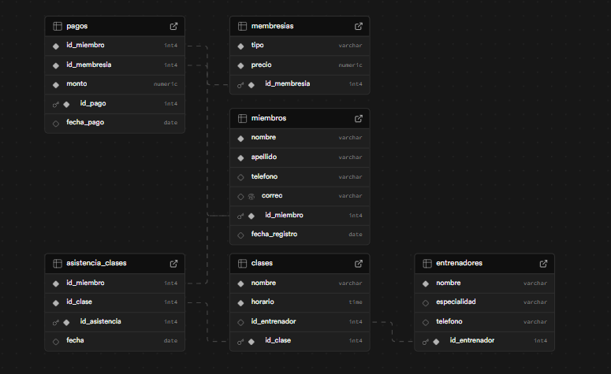

# 🏋️ Sistema de Gestión de Gimnasio

Este proyecto es un sistema de gestión de un gimnasio, desarrollado como parte de un trabajo académico.  
El objetivo es administrar **miembros, membresías, entrenadores, clases, asistencia y pagos**, a través de consultas SQL organizadas y bien documentadas.

---

## 📌 Descripción del Proyecto

El sistema permite:
- Registrar y administrar **miembros** del gimnasio.  
- Gestionar **tipos de membresías** con sus precios.  
- Registrar **entrenadores** y asignarlos a clases.  
- Crear y administrar **clases** (incluyendo spinning).  
- Controlar la **asistencia** de miembros a cada clase.  
- Registrar y consultar los **pagos** de cada miembro.  
- Generar **reportes** sobre asistencia, pagos y clases.  

Este sistema está diseñado con una base de datos relacional en SQL.  

---

## 👥 Integrantes del Equipo

05 Ángeles Martínez

26 Nahomy Zavala

28 Tifanny Cáceres

30 Alejandro Padilla

34 Anibal Benites

50 Jhohan Melgar

## Diagrama Entidad - Relación

